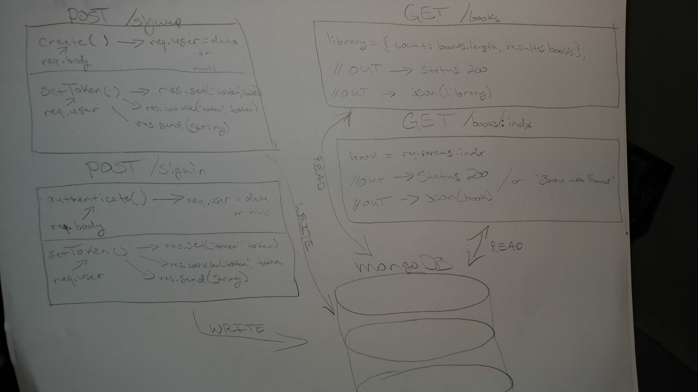

# LAB - 10

## API Server

### Author: James Dunn

### Links and Resources

- [submission PR](https://github.com/james-401-advanced-javascript/lab-10/pull/1)
- [travis](https://travis-ci.com/james-401-advanced-javascript/lab-10)
- [front-end](https://jamesdunn-lab-10.herokuapp.com)

#### Documentation

### Modules

#### `model.js`

#### `categories-model.js`

#### `products-model.js`

#### `todo-model.js`

#### `404.js`

#### `500.js`

#### `router.js`

#### `server.js`

##### Exported Values and Methods

###### `handleGetOne(req, res, next)`

###### `handlePost(req, res, next)`

###### `handlePut(req, res, next)`

###### `handleDelete(req, res, next)`

###### `populateTasks()`

### Setup

#### `.env` requirements

- `PORT` - 3000
- `MONGODB_URI` - mongodb://127.0.0.1:27017/app

#### Running the app

- `npm start`
- Endpoint: `index.js`

#### Tests

- How do you run tests?
- `npm test`

#### UML

